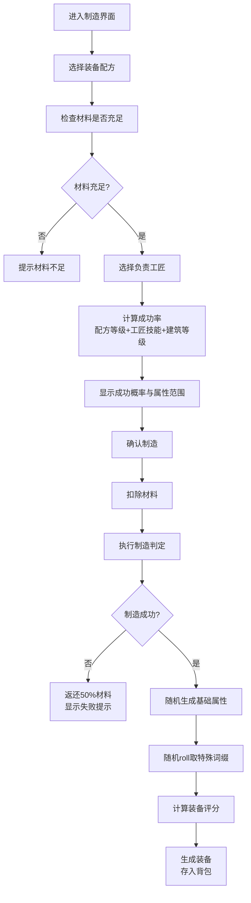
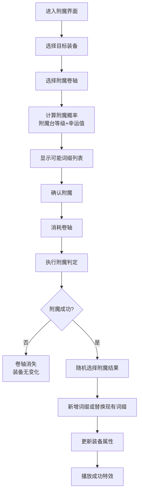
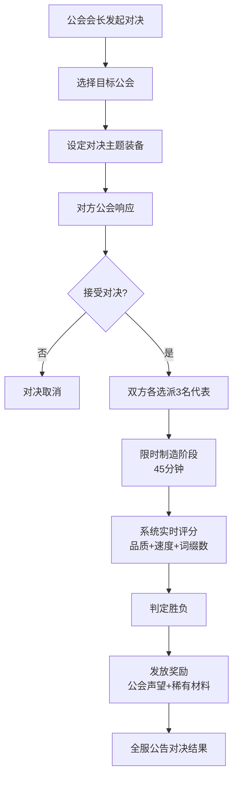

## 1. 产品概述

大型多人在线魔法工坊与装备附魔系统，玩家可创建专属工坊，招募工匠团队，通过采集材料、制造装备、附魔强化、参与竞赛等玩法，体验深度的工匠养成与装备交易乐趣。产品面向喜欢模拟经营、装备收集和社交竞技的游戏玩家。

## 2. 核心功能

### 2.1 用户角色

| 角色 | 注册方法 | 核心权限 |
|------|----------|----------|
| 玩家 | 游戏账号登录 | 创建工坊、制造装备、附魔、交易、参赛、加入公会 |
| 工坊主 | 创建工坊后自动获得 | 升级建筑、管理成员、设定工坊信息 |
| 公会会长 | 创建公会后自动获得 | 管理公会、升级公会建筑、发起工艺对决 |
| 公会副会长 | 会长任命 | 协助管理公会、处理成员申请 |

### 2.2 功能模块

1. **工坊系统**：工坊创建、流派选择、职位管理、建筑升级、工匠阵容
2. **制造系统**：配方学习、材料消耗、成功率计算、品质生成、词缀随机
3. **附魔系统**：卷轴消耗、词缀增减、概率计算、幸运值影响
4. **交易系统**：装备上架、定价建议、全服公告、购买流程
5. **装备评分赛**：每日赛事、自动排名、赛季奖励
6. **公会系统**：公会创建、职位管理、公会建筑、全员贡献
7. **工艺对决**：对决发起、代表选派、实时判定、奖励发放
8. **排行榜系统**：周榜生成、PDF报告导出、数据可视化
9. **工坊查看**：他人工坊浏览、布局展示、工匠查看

### 2.3 页面详情

| 页面名称 | 模块名称 | 功能描述 |
|-----------|-------------|---------------------|
| 首页仪表盘 | 数据概览 | 显示工坊等级、资金、今日制造数量、待办事项 |
| 首页仪表盘 | 快捷入口 | 快速进入制造、附魔、交易、赛事模块 |
| 首页仪表盘 | 全服公告 | 展示交易成交、赛事结果、对决胜负公告 |
| 工坊管理 | 工坊信息 | 编辑工坊名称、招牌、流派展示 |
| 工坊管理 | 成员管理 | 工匠、学徒、管事的招募、解雇、职位调整 |
| 工坊管理 | 建筑升级 | 熔炉、附魔台、材料仓库的升级申请与批准 |
| 装备制造 | 配方列表 | 展示已解锁配方，按流派分类 |
| 装备制造 | 制造界面 | 选择配方、分配工匠、查看材料消耗、计算成功率 |
| 装备制造 | 结果展示 | 成功/失败动画、装备属性展示、词缀特效 |
| 装备附魔 | 装备选择 | 背包中可附魔装备列表 |
| 装备附魔 | 附魔操作 | 选择卷轴、预览可能词缀、显示成功概率 |
| 装备附魔 | 附魔结果 | 属性变化展示、词缀增减动画 |
| 交易市场 | 商品列表 | 装备和卷轴的分类浏览、筛选、搜索 |
| 交易市场 | 上架界面 | 物品选择、定价输入、系统价格建议 |
| 交易市场 | 购买界面 | 物品详情、确认购买、成交公告 |
| 装备评分赛 | 赛事大厅 | 今日赛事主题、参赛入口、排行榜 |
| 装备评分赛 | 参赛提交 | 装备选择、评分预览、提交参赛 |
| 装备评分赛 | 赛季奖励 | 赛季进度、奖励预览、领奖入口 |
| 公会大厅 | 公会信息 | 公会等级、成员列表、职位展示 |
| 公会大厅 | 建筑管理 | 联合熔炉、大师附魔台的升级进度与贡献 |
| 公会大厅 | 对决中心 | 发起/接受对决、对决历史、奖励记录 |
| 排行榜 | 榜单展示 | 装备评分榜、制造数量榜、附魔次数榜 |
| 排行榜 | 报告导出 | PDF报告生成、装备属性雷达图、制造趋势图 |
| 工坊浏览 | 工坊列表 | 全服工坊按流派、等级筛选 |
| 工坊浏览 | 工坊详情 | 工坊布局展示、工匠阵容、建筑等级 |
| 背包系统 | 物品管理 | 材料、装备、卷轴的分类展示与操作 |

## 3. 核心流程

### 3.1 装备制造流程

### 3.2 附魔流程

### 3.3 工艺对决流程

## 4. 用户界面设计

### 4.1 设计风格

**整体风格：奇幻魔法朋克风**

- **主色调**：深邃紫罗兰 `#6C3483` 作为主色，代表神秘魔法
- **辅助色**：熔金黄 `#F39C12` 代表铁匠锻造，翡翠绿 `#27AE60` 代表裁缝工艺，宝石蓝 `#3498DB` 代表珠宝工艺
- **中性色**：深炭灰 `#1C1C28` 背景色，暗金 `#D4AF37` 边框装饰色
- **按钮风格**：3D浮雕效果，渐变填充，金边装饰，hover时有魔法光效
- **字体**：标题使用 Cinzel Decorative（欧式古典衬线），正文使用 Noto Serif SC（中文衬线），数字使用 JetBrains Mono（等宽字体）
- **布局风格**：不对称卡片布局，对角流动线，装饰性魔法符文边框，玻璃拟态弹窗
- **图标风格**：手绘风格魔法图标，带有发光效果，使用 Unicode 魔法符号和 emoji 点缀

### 4.2 页面设计概述

| 页面名称 | 模块名称 | UI元素 |
|-----------|-------------|-------------|
| 首页仪表盘 | 数据概览 | 玻璃拟态卡片、实时数据跳动动画、进度条光效、符文装饰边框 |
| 首页仪表盘 | 快捷入口 | 六边形图标按钮、悬浮发光效果、点击缩放动画 |
| 工坊管理 | 工坊信息 | 招牌设计预览、流派徽章、3D工坊建筑模型展示 |
| 工坊管理 | 建筑升级 | 建筑剖面图、升级进度条、资源消耗对比表、批准印章动效 |
| 装备制造 | 制造界面 | 熔炉/裁缝台/珠宝台动态背景、材料图标飞入动画、成功率进度条 |
| 装备制造 | 结果展示 | 成功时金色光柱特效、装备3D旋转展示、词缀闪光动画 |
| 装备附魔 | 附魔界面 | 魔法阵旋转动画、卷轴展开效果、概率六边形雷达图 |
| 交易市场 | 商品列表 | 稀有度边框颜色、装备缩略图、价格走势小图表 |
| 装备评分赛 | 赛事大厅 | 倒计时计时器、排名升降动画、奖牌光效 |
| 公会大厅 | 对决中心 | VS对战界面、双方公会徽章、实时分数跳动 |
| 排行榜 | 报告导出 | 雷达图动画生成、趋势图折线动画、PDF下载按钮 |

### 4.3 响应式设计

- **桌面优先**：1920px基准设计，12列网格布局
- **平板适配**：1024px断点，侧边栏收起为图标，卡片重新排列
- **手机适配**：768px断点，底部导航栏，单列布局，手势操作支持
- **触控优化**：最小触控面积48x48px，下拉刷新，长按预览

### 4.4 视觉特效

- **页面加载**：魔法粒子汇聚效果，元素渐次入场
- **制造成功**：金色光柱从屏幕中央升起，装备从光芒中浮现
- **稀有词缀**：词缀文字带有彩虹流光效果，周围漂浮魔法粒子
- **按钮交互**：hover时边缘发光，点击时产生涟漪扩散
- **公告提示**：全服公告从顶部滑入，带有金色边框闪烁效果
- **数据更新**：数值变化时带有滚动数字动画
