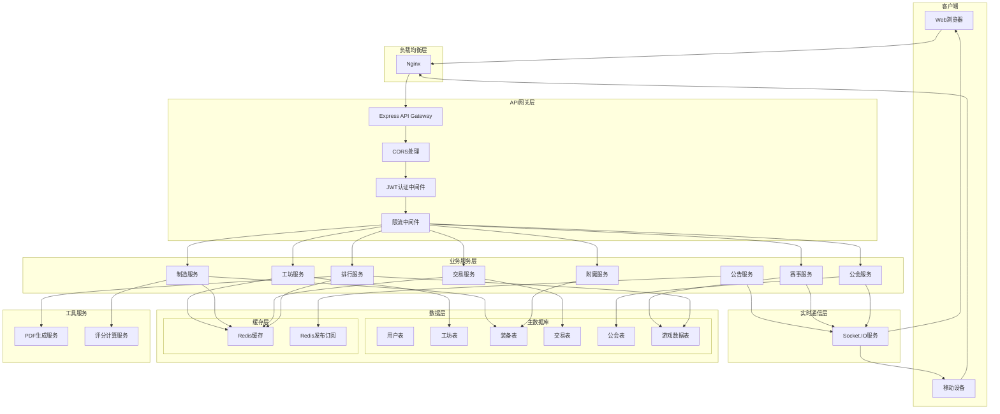
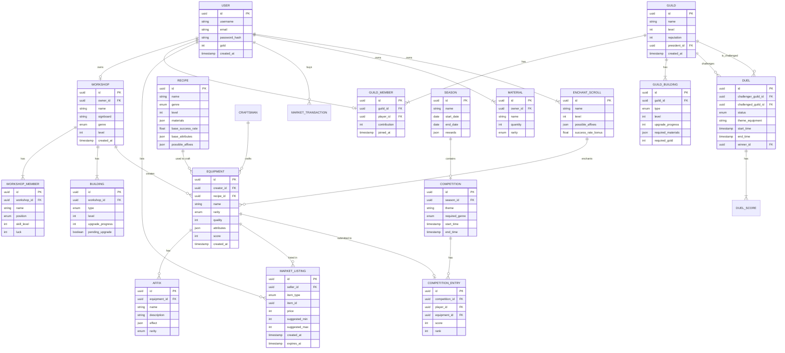

## 1. 架构设计


## 2. 技术描述

### 2.1 技术栈选型

| 层级 | 技术选型 | 版本 | 用途 |
|------|----------|------|------|
| 前端框架 | React | 18.x | UI构建 |
| 前端语言 | TypeScript | 5.x | 类型安全 |
| 构建工具 | Vite | 5.x | 构建与开发 |
| 样式方案 | TailwindCSS | 3.x | 原子化CSS |
| 状态管理 | Zustand | 4.x | 全局状态 |
| 路由管理 | React Router | 6.x | 页面路由 |
| 图表库 | Recharts | 2.x | 雷达图、趋势图 |
| PDF生成 | jsPDF + html2canvas | 2.x/1.x | PDF报告导出 |
| 动画库 | Framer Motion | 11.x | 动画效果 |
| 图标库 | Lucide React | 0.x | 图标组件 |
| 后端框架 | Express | 4.x | API服务 |
| 后端语言 | TypeScript | 5.x | 类型安全 |
| 主数据库 | PostgreSQL | 15.x | 数据持久化 |
| 缓存数据库 | Redis | 7.x | 缓存与实时数据 |
| ORM | Prisma | 5.x | 数据库操作 |
| WebSocket | Socket.IO | 4.x | 实时通信 |
| 认证 | JWT | 9.x | 身份认证 |

### 2.2 项目初始化

- 使用 `react-express-ts` 模板初始化项目
- 包管理器：npm（macOS环境）
- 初始化命令：`npm init vite-init@latest -y . -- --template react-express-ts --force`

## 3. 路由定义

| 路由路径 | 页面名称 | 说明 |
|----------|----------|------|
| `/` | 首页仪表盘 | 数据概览、快捷入口、全服公告 |
| `/workshop` | 工坊管理 | 工坊信息、成员管理、建筑升级 |
| `/crafting` | 装备制造 | 配方列表、制造界面、结果展示 |
| `/enchanting` | 装备附魔 | 装备选择、附魔操作、结果展示 |
| `/market` | 交易市场 | 商品列表、上架界面、购买界面 |
| `/arena` | 装备评分赛 | 赛事大厅、参赛提交、赛季奖励 |
| `/guild` | 公会大厅 | 公会信息、建筑管理、对决中心 |
| `/ranking` | 排行榜 | 榜单展示、报告导出 |
| `/browse` | 工坊浏览 | 工坊列表、工坊详情 |
| `/inventory` | 背包系统 | 物品管理 |
| `/login` | 登录页 | 用户登录 |

## 4. API 定义

### 4.1 通用响应结构

```typescript
interface ApiResponse<T> {
  code: number;
  message: string;
  data: T;
  timestamp: number;
}

interface PaginationParams {
  page: number;
  pageSize: number;
}

interface PaginatedResponse<T> {
  items: T[];
  total: number;
  page: number;
  pageSize: number;
}
```

### 4.2 工坊相关 API

```typescript
// 工坊信息
interface Workshop {
  id: string;
  name: string;
  signboard: string;
  genre: 'blacksmith' | 'tailor' | 'jeweler';
  level: number;
  ownerId: string;
  buildings: Building[];
  members: WorkshopMember[];
  createdAt: Date;
}

interface Building {
  type: 'furnace' | 'enchanting_table' | 'warehouse';
  level: number;
  upgradeProgress: number;
  pendingUpgrade: boolean;
}

interface WorkshopMember {
  id: string;
  name: string;
  position: 'master' | 'journeyman' | 'apprentice' | 'steward';
  skillLevel: number;
  luck: number;
}

// POST /api/workshop/create
interface CreateWorkshopRequest {
  name: string;
  signboard: string;
  genre: 'blacksmith' | 'tailor' | 'jeweler';
}

// GET /api/workshop/:id
// PUT /api/workshop/:id
// POST /api/workshop/:id/building/upgrade
interface UpgradeBuildingRequest {
  buildingType: 'furnace' | 'enchanting_table' | 'warehouse';
}

// POST /api/workshop/:id/building/approve
interface ApproveUpgradeRequest {
  buildingType: 'furnace' | 'enchanting_table' | 'warehouse';
}
```

### 4.3 制造相关 API

```typescript
interface Recipe {
  id: string;
  name: string;
  genre: 'blacksmith' | 'tailor' | 'jeweler';
  level: number;
  materials: MaterialRequirement[];
  baseSuccessRate: number;
  baseAttributes: AttributeRange[];
  possibleAffixes: string[];
}

interface MaterialRequirement {
  materialId: string;
  amount: number;
}

interface AttributeRange {
  attribute: string;
  min: number;
  max: number;
}

interface Equipment {
  id: string;
  name: string;
  rarity: 'common' | 'uncommon' | 'rare' | 'epic' | 'legendary';
  quality: number;
  attributes: Record<string, number>;
  affixes: Affix[];
  score: number;
  creatorId: string;
  createdAt: Date;
}

interface Affix {
  id: string;
  name: string;
  description: string;
  effect: Record<string, number>;
  rarity: 'common' | 'rare' | 'legendary';
}

// GET /api/recipes
// POST /api/crafting/craft
interface CraftRequest {
  recipeId: string;
  craftsmanId: string;
}

interface CraftResponse {
  success: boolean;
  equipment?: Equipment;
  returnedMaterials?: MaterialRequirement[];
  message: string;
}

// POST /api/crafting/calculate
interface CalculateSuccessRequest {
  recipeId: string;
  craftsmanId: string;
}

interface CalculateSuccessResponse {
  successRate: number;
  attributeRanges: AttributeRange[];
  possibleAffixes: string[];
}
```

### 4.4 附魔相关 API

```typescript
interface EnchantScroll {
  id: string;
  name: string;
  level: number;
  possibleAffixes: string[];
  successRateBonus: number;
}

// POST /api/enchanting/apply
interface EnchantRequest {
  equipmentId: string;
  scrollId: string;
}

interface EnchantResponse {
  success: boolean;
  equipment: Equipment;
  addedAffix?: Affix;
  replacedAffix?: Affix;
  message: string;
}

// POST /api/enchanting/calculate
interface CalculateEnchantRequest {
  equipmentId: string;
  scrollId: string;
}

interface CalculateEnchantResponse {
  successRate: number;
  possibleAffixes: Affix[];
  replaceChance: number;
}
```

### 4.5 交易相关 API

```typescript
interface MarketListing {
  id: string;
  sellerId: string;
  sellerName: string;
  itemType: 'equipment' | 'scroll';
  item: Equipment | EnchantScroll;
  price: number;
  suggestedPriceMin: number;
  suggestedPriceMax: number;
  createdAt: Date;
  expiresAt: Date;
}

interface PriceHistory {
  date: Date;
  avgPrice: number;
  volume: number;
}

// GET /api/market/listings
// POST /api/market/list
interface ListItemRequest {
  itemId: string;
  itemType: 'equipment' | 'scroll';
  price: number;
}

// POST /api/market/buy/:listingId
// GET /api/market/price-suggestion/:itemId
interface PriceSuggestionResponse {
  minPrice: number;
  maxPrice: number;
  avgPrice7d: number;
  priceHistory: PriceHistory[];
}
```

### 4.6 赛事相关 API

```typescript
interface Competition {
  id: string;
  theme: string;
  requiredGenre: 'blacksmith' | 'tailor' | 'jeweler' | 'all';
  startTime: Date;
  endTime: Date;
  entries: CompetitionEntry[];
}

interface CompetitionEntry {
  id: string;
  competitionId: string;
  playerId: string;
  equipment: Equipment;
  score: number;
  rank: number;
}

interface Season {
  id: string;
  name: string;
  startDate: Date;
  endDate: Date;
  rewards: SeasonReward[];
}

interface SeasonReward {
  rank: number;
  itemName: string;
  itemType: 'enchant_recipe' | 'material' | 'scroll';
}

// GET /api/arena/today
// POST /api/arena/submit
interface SubmitEntryRequest {
  equipmentId: string;
}

// GET /api/arena/ranking
// GET /api/arena/season
```

### 4.7 公会相关 API

```typescript
interface Guild {
  id: string;
  name: string;
  level: number;
  reputation: number;
  presidentId: string;
  vicePresidentIds: string[];
  members: GuildMember[];
  buildings: GuildBuilding[];
  createdAt: Date;
}

interface GuildMember {
  id: string;
  name: string;
  contribution: number;
  joinedAt: Date;
}

interface GuildBuilding {
  type: 'union_furnace' | 'master_enchanting_table';
  level: number;
  upgradeProgress: number;
  requiredMaterials: MaterialRequirement[];
  requiredGold: number;
}

interface Duel {
  id: string;
  challengerGuildId: string;
  challengedGuildId: string;
  status: 'pending' | 'accepted' | 'rejected' | 'completed';
  themeEquipment: string;
  representatives: DuelRepresentative[];
  startTime?: Date;
  endTime?: Date;
  winnerId?: string;
  scores: DuelScore[];
}

interface DuelRepresentative {
  guildId: string;
  playerId: string;
  playerName: string;
}

interface DuelScore {
  playerId: string;
  quality: number;
  speed: number;
  affixCount: number;
  total: number;
}

// POST /api/guild/create
// GET /api/guild/:id
// POST /api/guild/:id/contribute
interface ContributeRequest {
  materials: MaterialRequirement[];
  gold: number;
}

// POST /api/guild/:id/building/upgrade
// POST /api/duel/challenge
interface ChallengeRequest {
  targetGuildId: string;
  themeEquipment: string;
  representativeIds: string[];
}

// POST /api/duel/:id/respond
interface RespondDuelRequest {
  accept: boolean;
  representativeIds?: string[];
}

// GET /api/duel/:id/live
```

### 4.8 排行榜相关 API

```typescript
interface RankingEntry {
  rank: number;
  playerId: string;
  playerName: string;
  workshopName: string;
  value: number;
  trend: 'up' | 'down' | 'stable';
}

interface WeeklyReport {
  weekStart: Date;
  weekEnd: Date;
  topEquipment: Equipment[];
  attributeDistribution: Record<string, number[]>;
  craftingTrend: { date: Date; count: number }[];
  rankings: {
    byScore: RankingEntry[];
    byCraftCount: RankingEntry[];
    byEnchantCount: RankingEntry[];
  };
}

// GET /api/ranking/weekly
// GET /api/ranking/weekly/:type
// GET /api/ranking/report
```

## 5. 服务器架构图



## 6. 数据模型

### 6.1 实体关系图



### 6.2 数据定义语言 (DDL)

```sql
-- 用户表
CREATE TABLE users (
    id UUID PRIMARY KEY DEFAULT gen_random_uuid(),
    username VARCHAR(50) UNIQUE NOT NULL,
    email VARCHAR(100) UNIQUE NOT NULL,
    password_hash VARCHAR(255) NOT NULL,
    gold INTEGER DEFAULT 1000,
    luck INTEGER DEFAULT 10,
    created_at TIMESTAMP DEFAULT CURRENT_TIMESTAMP,
    updated_at TIMESTAMP DEFAULT CURRENT_TIMESTAMP
);

-- 工坊表
CREATE TABLE workshops (
    id UUID PRIMARY KEY DEFAULT gen_random_uuid(),
    owner_id UUID REFERENCES users(id) ON DELETE CASCADE,
    name VARCHAR(100) NOT NULL,
    signboard VARCHAR(200),
    genre VARCHAR(20) NOT NULL CHECK (genre IN ('blacksmith', 'tailor', 'jeweler')),
    level INTEGER DEFAULT 1,
    created_at TIMESTAMP DEFAULT CURRENT_TIMESTAMP,
    updated_at TIMESTAMP DEFAULT CURRENT_TIMESTAMP,
    UNIQUE(owner_id)
);

-- 工坊成员表
CREATE TABLE workshop_members (
    id UUID PRIMARY KEY DEFAULT gen_random_uuid(),
    workshop_id UUID REFERENCES workshops(id) ON DELETE CASCADE,
    name VARCHAR(50) NOT NULL,
    position VARCHAR(20) NOT NULL CHECK (position IN ('master', 'journeyman', 'apprentice', 'steward')),
    skill_level INTEGER DEFAULT 1,
    luck INTEGER DEFAULT 10,
    created_at TIMESTAMP DEFAULT CURRENT_TIMESTAMP
);

-- 建筑表
CREATE TABLE buildings (
    id UUID PRIMARY KEY DEFAULT gen_random_uuid(),
    workshop_id UUID REFERENCES workshops(id) ON DELETE CASCADE,
    type VARCHAR(20) NOT NULL CHECK (type IN ('furnace', 'enchanting_table', 'warehouse')),
    level INTEGER DEFAULT 1,
    upgrade_progress INTEGER DEFAULT 0,
    pending_upgrade BOOLEAN DEFAULT FALSE,
    created_at TIMESTAMP DEFAULT CURRENT_TIMESTAMP,
    UNIQUE(workshop_id, type)
);

-- 配方表
CREATE TABLE recipes (
    id UUID PRIMARY KEY DEFAULT gen_random_uuid(),
    name VARCHAR(100) NOT NULL,
    genre VARCHAR(20) NOT NULL CHECK (genre IN ('blacksmith', 'tailor', 'jeweler')),
    level INTEGER NOT NULL,
    materials JSONB NOT NULL,
    base_success_rate DECIMAL(5,2) NOT NULL,
    base_attributes JSONB NOT NULL,
    possible_affixes JSONB NOT NULL,
    created_at TIMESTAMP DEFAULT CURRENT_TIMESTAMP
);

-- 装备表
CREATE TABLE equipments (
    id UUID PRIMARY KEY DEFAULT gen_random_uuid(),
    owner_id UUID REFERENCES users(id) ON DELETE CASCADE,
    creator_id UUID REFERENCES users(id),
    recipe_id UUID REFERENCES recipes(id),
    name VARCHAR(100) NOT NULL,
    rarity VARCHAR(20) NOT NULL CHECK (rarity IN ('common', 'uncommon', 'rare', 'epic', 'legendary')),
    quality INTEGER NOT NULL,
    attributes JSONB NOT NULL,
    score INTEGER NOT NULL,
    is_listed BOOLEAN DEFAULT FALSE,
    created_at TIMESTAMP DEFAULT CURRENT_TIMESTAMP
);

-- 词缀表
CREATE TABLE affixes (
    id UUID PRIMARY KEY DEFAULT gen_random_uuid(),
    equipment_id UUID REFERENCES equipments(id) ON DELETE CASCADE,
    name VARCHAR(50) NOT NULL,
    description TEXT,
    effect JSONB NOT NULL,
    rarity VARCHAR(20) NOT NULL CHECK (rarity IN ('common', 'rare', 'legendary')),
    created_at TIMESTAMP DEFAULT CURRENT_TIMESTAMP
);

-- 附魔卷轴表
CREATE TABLE enchant_scrolls (
    id UUID PRIMARY KEY DEFAULT gen_random_uuid(),
    owner_id UUID REFERENCES users(id) ON DELETE CASCADE,
    name VARCHAR(100) NOT NULL,
    level INTEGER NOT NULL,
    possible_affixes JSONB NOT NULL,
    success_rate_bonus DECIMAL(5,2) NOT NULL,
    is_listed BOOLEAN DEFAULT FALSE,
    created_at TIMESTAMP DEFAULT CURRENT_TIMESTAMP
);

-- 材料表
CREATE TABLE materials (
    id UUID PRIMARY KEY DEFAULT gen_random_uuid(),
    owner_id UUID REFERENCES users(id) ON DELETE CASCADE,
    name VARCHAR(50) NOT NULL,
    quantity INTEGER DEFAULT 0,
    rarity VARCHAR(20) NOT NULL CHECK (rarity IN ('common', 'uncommon', 'rare', 'epic', 'legendary')),
    created_at TIMESTAMP DEFAULT CURRENT_TIMESTAMP,
    UNIQUE(owner_id, name)
);

-- 交易上架表
CREATE TABLE market_listings (
    id UUID PRIMARY KEY DEFAULT gen_random_uuid(),
    seller_id UUID REFERENCES users(id) ON DELETE CASCADE,
    item_type VARCHAR(20) NOT NULL CHECK (item_type IN ('equipment', 'scroll')),
    item_id UUID NOT NULL,
    price INTEGER NOT NULL,
    suggested_min INTEGER NOT NULL,
    suggested_max INTEGER NOT NULL,
    is_active BOOLEAN DEFAULT TRUE,
    created_at TIMESTAMP DEFAULT CURRENT_TIMESTAMP,
    expires_at TIMESTAMP NOT NULL
);

-- 交易记录表
CREATE TABLE market_transactions (
    id UUID PRIMARY KEY DEFAULT gen_random_uuid(),
    listing_id UUID REFERENCES market_listings(id),
    buyer_id UUID REFERENCES users(id),
    seller_id UUID REFERENCES users(id),
    price INTEGER NOT NULL,
    item_type VARCHAR(20) NOT NULL,
    item_id UUID NOT NULL,
    created_at TIMESTAMP DEFAULT CURRENT_TIMESTAMP
);

-- 赛事表
CREATE TABLE competitions (
    id UUID PRIMARY KEY DEFAULT gen_random_uuid(),
    season_id UUID REFERENCES seasons(id),
    theme VARCHAR(100) NOT NULL,
    required_genre VARCHAR(20) CHECK (required_genre IN ('blacksmith', 'tailor', 'jeweler', 'all')),
    start_time TIMESTAMP NOT NULL,
    end_time TIMESTAMP NOT NULL,
    created_at TIMESTAMP DEFAULT CURRENT_TIMESTAMP
);

-- 参赛表
CREATE TABLE competition_entries (
    id UUID PRIMARY KEY DEFAULT gen_random_uuid(),
    competition_id UUID REFERENCES competitions(id) ON DELETE CASCADE,
    player_id UUID REFERENCES users(id),
    equipment_id UUID REFERENCES equipments(id),
    score INTEGER NOT NULL,
    rank INTEGER,
    created_at TIMESTAMP DEFAULT CURRENT_TIMESTAMP,
    UNIQUE(competition_id, player_id)
);

-- 赛季表
CREATE TABLE seasons (
    id UUID PRIMARY KEY DEFAULT gen_random_uuid(),
    name VARCHAR(100) NOT NULL,
    start_date DATE NOT NULL,
    end_date DATE NOT NULL,
    rewards JSONB NOT NULL,
    is_active BOOLEAN DEFAULT TRUE,
    created_at TIMESTAMP DEFAULT CURRENT_TIMESTAMP
);

-- 公会表
CREATE TABLE guilds (
    id UUID PRIMARY KEY DEFAULT gen_random_uuid(),
    name VARCHAR(100) UNIQUE NOT NULL,
    level INTEGER DEFAULT 1,
    reputation INTEGER DEFAULT 0,
    president_id UUID REFERENCES users(id),
    created_at TIMESTAMP DEFAULT CURRENT_TIMESTAMP
);

-- 公会成员表
CREATE TABLE guild_members (
    id UUID PRIMARY KEY DEFAULT gen_random_uuid(),
    guild_id UUID REFERENCES guilds(id) ON DELETE CASCADE,
    player_id UUID REFERENCES users(id) ON DELETE CASCADE,
    role VARCHAR(20) NOT NULL CHECK (role IN ('president', 'vice_president', 'member')),
    contribution INTEGER DEFAULT 0,
    joined_at TIMESTAMP DEFAULT CURRENT_TIMESTAMP,
    UNIQUE(player_id)
);

-- 公会建筑表
CREATE TABLE guild_buildings (
    id UUID PRIMARY KEY DEFAULT gen_random_uuid(),
    guild_id UUID REFERENCES guilds(id) ON DELETE CASCADE,
    type VARCHAR(30) NOT NULL CHECK (type IN ('union_furnace', 'master_enchanting_table')),
    level INTEGER DEFAULT 1,
    upgrade_progress INTEGER DEFAULT 0,
    required_materials JSONB NOT NULL,
    required_gold INTEGER NOT NULL,
    created_at TIMESTAMP DEFAULT CURRENT_TIMESTAMP,
    UNIQUE(guild_id, type)
);

-- 对决表
CREATE TABLE duels (
    id UUID PRIMARY KEY DEFAULT gen_random_uuid(),
    challenger_guild_id UUID REFERENCES guilds(id),
    challenged_guild_id UUID REFERENCES guilds(id),
    status VARCHAR(20) NOT NULL CHECK (status IN ('pending', 'accepted', 'rejected', 'completed')),
    theme_equipment VARCHAR(100) NOT NULL,
    start_time TIMESTAMP,
    end_time TIMESTAMP,
    winner_id UUID REFERENCES guilds(id),
    created_at TIMESTAMP DEFAULT CURRENT_TIMESTAMP
);

-- 对决代表表
CREATE TABLE duel_representatives (
    id UUID PRIMARY KEY DEFAULT gen_random_uuid(),
    duel_id UUID REFERENCES duels(id) ON DELETE CASCADE,
    guild_id UUID REFERENCES guilds(id),
    player_id UUID REFERENCES users(id),
    player_name VARCHAR(50) NOT NULL,
    created_at TIMESTAMP DEFAULT CURRENT_TIMESTAMP
);

-- 对决评分表
CREATE TABLE duel_scores (
    id UUID PRIMARY KEY DEFAULT gen_random_uuid(),
    duel_id UUID REFERENCES duels(id) ON DELETE CASCADE,
    player_id UUID REFERENCES users(id),
    quality INTEGER NOT NULL,
    speed INTEGER NOT NULL,
    affix_count INTEGER NOT NULL,
    total INTEGER NOT NULL,
    created_at TIMESTAMP DEFAULT CURRENT_TIMESTAMP
);

-- 全服公告表
CREATE TABLE announcements (
    id UUID PRIMARY KEY DEFAULT gen_random_uuid(),
    type VARCHAR(50) NOT NULL,
    content TEXT NOT NULL,
    data JSONB,
    created_at TIMESTAMP DEFAULT CURRENT_TIMESTAMP
);

-- 周排行榜表
CREATE TABLE weekly_rankings (
    id UUID PRIMARY KEY DEFAULT gen_random_uuid(),
    week_start DATE NOT NULL,
    week_end DATE NOT NULL,
    ranking_type VARCHAR(30) NOT NULL CHECK (ranking_type IN ('score', 'craft_count', 'enchant_count')),
    rankings JSONB NOT NULL,
    created_at TIMESTAMP DEFAULT CURRENT_TIMESTAMP,
    UNIQUE(week_start, week_end, ranking_type)
);

-- 索引
CREATE INDEX idx_equipments_owner ON equipments(owner_id);
CREATE INDEX idx_equipments_score ON equipments(score DESC);
CREATE INDEX idx_market_listings_active ON market_listings(is_active);
CREATE INDEX idx_competition_entries_score ON competition_entries(score DESC);
CREATE INDEX idx_announcements_created ON announcements(created_at DESC);
```
